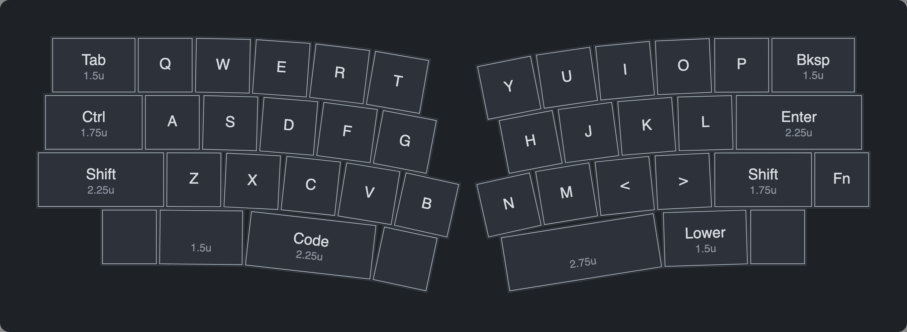
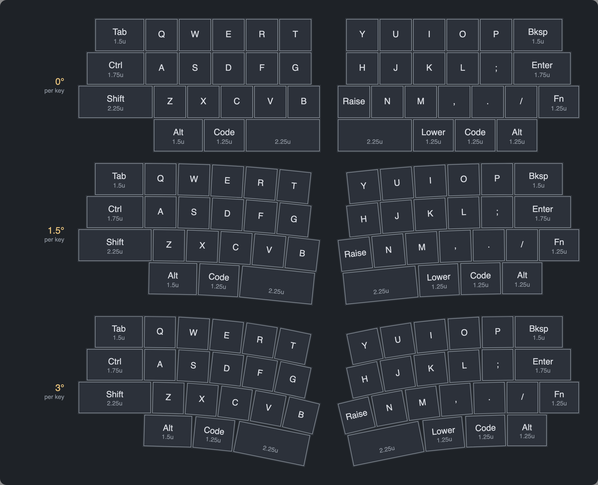
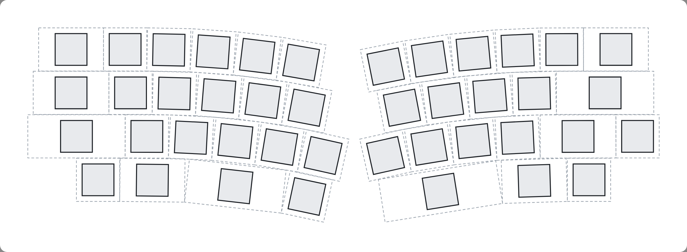

# Alice 40% Layout Designer

A small desktop app for designing a **curved, Alice-style 40% split layout** one keycap at a time,
then exporting it as a DXF (for plate and case CAD) or as keyboard-layout-editor.com JSON.



## Features

- **Edit each keycap.** Set its label, width (0.25u steps) or make it a spacer. Add or delete keys, up to 10 per row per half.
- **Alice-style stagger.** Top and Home rows are offset from the shift row's outer edge. The spacebar row
  lines up with the shift row's inner edge (B / N). Offsets move in 0.125u steps.
- **A smooth curve down to the center.** Set in degrees per 1u key (0.05° steps), with the same rate on both
  halves. The outer modifiers (Tab/Ctrl/Shift, Bksp/Enter/Fn) stay perfectly straight at an angle you choose.
- **Center keys meet evenly.** The half with longer modifiers starts its curve later, so B and N end at the same
  height and angle. The modifier rows stay level too.
- **Real Cherry MX spacing.** 1u = 19.05 mm, and neighbouring keys share their bottom corners.
- **No key overlap.** Where curved rows would touch, the gap between them grows by a fraction of a mm. The
  panel shows the overlap count, and export warns before writing a plate that wouldn't work.



## Quick start

The app uses Python's built-in Tk toolkit, with no pip packages. It needs Tk 8.6 or newer to draw rotated
labels, and macOS's built-in `/usr/bin/python3` only has Tk 8.5, so use Homebrew Python:

```sh
brew install python-tk@3.14
/opt/homebrew/bin/python3 alice.py
```

## Using it

| Panel | What it does |
|---|---|
| **Shape** | Curve (° per 1u key), outer key angle (0 = square to the case edge), *Match center keys*, gap between the halves |
| **Left / Right stagger** | Top, Home and Bottom row offsets in 0.125u steps; + moves the row toward the center |
| **Selected key** | Click a key to change its label or width, make it a spacer, add a key beside it or delete it |
| **File** | Save / Open your layout (`.json`), Export DXF, Export KLE |

The panel also shows the selected key's center (mm) and angle, the overall footprint size, and whether any
keys overlap.

## Exports

**DXF** is in millimetres, with two layers:

- `KEYCAP_1U`: the 19.05 mm footprint of every key, for sizing the case opening.
- `SWITCH_14MM`: 14 × 14 mm MX switch cutouts for the plate.



**KLE** writes a keyboard-layout-editor.com JSON file with every key rotated in place. Load it into KLE to
check the layout, or into a plate generator such as ai03's to add stabilizer cutouts. The DXF only has one
switch cutout per key, with no stabilizer cutouts for wide keys like the spacebars.

## How it works

Every behaviour is written down as a numbered **design rule** (1–11) at the top of [`alice.py`](alice.py).
Code comments say `rule N` where each rule is enforced, and [`test_alice.py`](test_alice.py) checks every
one. That includes an overlap sweep over 144 combinations of curve, angle and stagger.

```sh
/opt/homebrew/bin/python3 test_alice.py   # prints "ok"
```

In short:

- Each half is laid out from the outer edge inward.
- Rows run straight until the end of the longest outer modifier, then curve around one shared center.
  The curves are concentric, 1u apart.
- Every key's bottom edge is a chord of its row's curve, so pitch stays exactly 19.05 mm.
- The right half is built as a mirror image, then placed `gap` units from the left.

## Files

| File | |
|---|---|
| `alice.py` | The whole app: geometry, collision check, exports, Tk UI |
| `test_alice.py` | Self-check for the design rules |
| `docs/` | README images |
