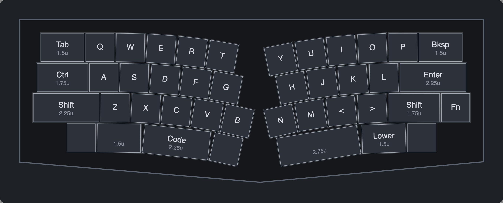
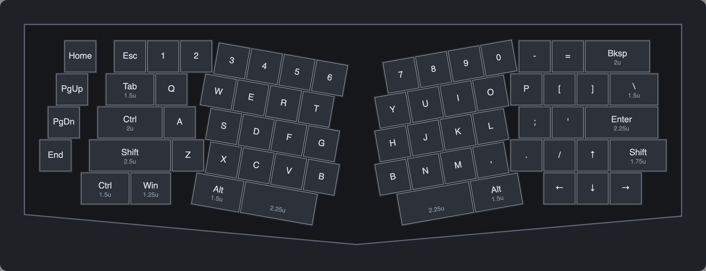

# Alice Layout Designer

A small desktop app for designing an **Alice-style split keyboard layout** one keycap at a time, then exporting it
for plate and case CAD. It supports 40% and 60/65% sizes, with curved or straight-angled alphas.


## Features

- **40% and 60/65% sizes.** Both sizes have the same options; 60/65% adds a number row and starts from the
  Qwertykeys Neo Ergo layout. Each size keeps its own layout, and opening a file made for the other size tells you to
  switch.
- **Edit every keycap.** Set its label, width (0.25u steps) and type: key, spacer (an empty gap) or WK blocker. Add
  or delete keys, up to 10 per row per half.
- **Alice-style stagger.** The rows above the shift row (Number, Top, Home) are offset from the shift row's outer edge,
  and the spacebar row lines up with its inner edge (B / N). Offsets move in 0.125u steps.
- **Curved or straight bend.**
  - *Curve:* the alphas curve smoothly down toward the center (degrees per 1u key, 0.05° steps).
  - *Straight:* each row turns once at a fixed angle, like a classic Alice or the Neo Ergo.

  Either way, both halves bend at the same rate, and you can add extra straight length before the bend. The outer
  modifiers (Tab/Ctrl/Shift, Bksp/Enter/Fn, …) stay perfectly straight at an angle you choose.
- **Center keys meet evenly.** The half with longer modifiers starts its bend later, so B and N end at the same
  height and angle, and the modifier rows stay level.
- **Mod column.** An extra column of keys outside either half, like the Neo Ergo's macro keys. Choose how many keys
  (from the top), the distance from the main keys and a vertical offset; each mod key has its own label, width and
  left/right offset.
- **WK blockers.** Solid blanks of any width in the bottom row, like a winkeyless case.
- **Real Cherry MX spacing, no overlaps.** 1u = 19.05 mm, and neighbouring keys share their bottom corners. Keys never
  overlap:
  - Curved rows that would touch get a fraction of a millimetre more space.
  - In straight mode, rows stay exactly 19.05 mm apart, and the angled keys slide along their line to clear the turn.

  The status line shows the overlap count, and export warns before writing a plate that wouldn't work.
- **Case outline.** A preview of a simple Alice-style case: a straight top, square ends and a V bottom, with every
  edge exactly your chosen margin from the nearest key.






## Setup

The app is a single Python file using Python's built-in Tk toolkit, with no pip packages. You need:

- **Python 3.9 or newer**
- **Tk 8.6 or newer**, which draws the rotated key labels

First get the code:

```sh
git clone https://github.com/Noah-Mav/alice-layout-designer.git
cd alice-layout-designer
```

Then follow the steps for your system.

### macOS

macOS's built-in `/usr/bin/python3` only has Tk 8.5, so use Homebrew's Python instead:

```sh
brew install python python-tk
$(brew --prefix)/bin/python3 alice.py
```

Alternatively, the installer from [python.org](https://www.python.org/downloads/macos/) includes Tk 8.6. With that
installed, run `python3 alice.py`.

### Windows

1. Install Python from [python.org](https://www.python.org/downloads/windows/), or run
   `winget install Python.Python.3.13`. Tk comes with it; with the python.org installer, leave **tcl/tk and IDLE**
   ticked.
2. In the folder, run:

   ```powershell
   py alice.py
   ```

### Linux

Install Python's Tk package with your distribution's package manager:

| Distribution | Command |
|---|---|
| Debian / Ubuntu / Mint | `sudo apt install python3 python3-tk` |
| Fedora | `sudo dnf install python3 python3-tkinter` |
| Arch / Manjaro | `sudo pacman -S python tk` |
| openSUSE | `sudo zypper install python3 python3-tk` |

Then run:

```sh
python3 alice.py
```

### Checking your setup

If the window doesn't open, or the key labels aren't rotated, check the Tk version. Use the same Python command
you use to start the app (`py` on Windows):

```sh
python3 -c "import tkinter; print(tkinter.TkVersion)"
```

It should print `8.6` or higher. `No module named '_tkinter'` means the Tk package from the steps above is missing.

## Using it

| Where | What it does |
|---|---|
| **Top bar** | Size switch (40% / 60/65%), Open / Save a layout (`.json`), Export DXF / KLE |
| **Shape** | Bend (Curve / Straight), curve (° per key) or line angle (°), straight length before the bend, outer key angle (0 = square to the case edge), gap between the halves, *Match center keys*, *Show case outline* and its margin (mm) |
| **Stagger** | Left and right offsets for the Number (60/65% only), Top, Home and Bottom rows, in 0.125u steps; + moves a row toward the center. *Bottom from outer edge* measures the bottom row from the shift row's outer edge instead of B / N |
| **Mod column** | Per side: show it, how many keys from the top, vertical offset and distance from the main keys |
| **Key bar** (under the drawing) | Click a key to see where it is, change its label, width or type, add a key or WK blocker beside it (blockers: bottom row only), or delete it. A mod key shows its own left/right offset instead |
| **Status line** | Footprint size, case outline size when it's on, and whether any keys overlap |

Some tips:

- **Arrow keys:** put them in the straight part next to the outer keys and tick *Bottom from outer edge*, so ↓ lines
  up exactly under ↑. The Neo Ergo default does this.
- **Fewer mod keys:** set *Keys (from top)* to 3 or 4, or make a single mod key a spacer to leave a gap.
- **The case outline** is a preview only; it isn't included in the exports.

## Exports

**DXF** is in millimetres, with three layers:

- `KEYCAP_1U`: the 19.05 mm footprint of every key, for sizing the case opening.
- `SWITCH_14MM`: 14 × 14 mm MX switch cutouts for the plate.
- `WK_BLOCKER`: the outline of each WK blocker, for filling in the case top.


**KLE** writes a keyboard-layout-editor.com JSON file with every key rotated in place (WK blockers as decals). Load it
into KLE to check the layout, or into a plate generator such as ai03's to add stabilizer cutouts. The DXF has one
switch cutout per key and no stabilizer cutouts for wide keys like the spacebars.

## How it works

Every behaviour is written down as a numbered **design rule** (1–16) at the top of [`alice.py`](alice.py). Code
comments say `rule N` where each rule is enforced, and [`test_alice.py`](test_alice.py) checks each one. The tests
include overlap sweeps over hundreds of combinations of size, bend, angle, stagger and mod column settings.

```sh
python3 test_alice.py   # prints "ok" (on Windows: py test_alice.py; on macOS: the Homebrew python3)
```

In short:

- Each half is laid out from its outer edge inward; the right half is built as a mirror image, then placed `gap`
  units from the left.
- Rows run straight to the end of the longest outer modifier (plus any extra straight length). Then either:
  - *Curve:* they curve around one shared center, as concentric curves 1u apart.
  - *Straight:* they turn once at a fixed angle, with mitered turns that keep the rows 1u apart.
- Every key's bottom edge is a chord of its row's track, so neighbouring keys share corners and the pitch stays
  exactly 19.05 mm.
- The layout JSON (Save / Open) holds everything: rows of keys with widths, labels and types, stagger offsets, shape
  settings and the mod column.

## Files

| File | |
|---|---|
| `alice.py` | The whole app: geometry, collision checks, case outline, exports and the Tk UI |
| `test_alice.py` | Self-check for the design rules |
| `docs/` | README images |
